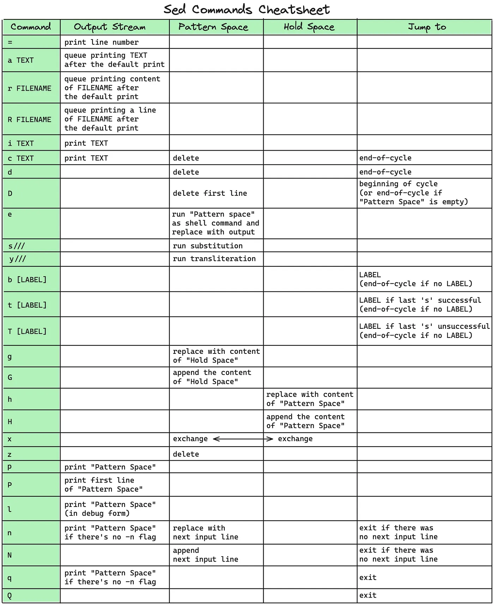

#### This note is for GNU sed.

sed maintain 2 buffers: **PATTERN SPACE** and **HOLD SPACE**. 

**SED WORKFLOW** 
For each line in **input**, sed perform following steps until all lines have been processed.

The **input** is either a file specified by user, or **stdin** if no filename is specified

1. Read one line into **PATTERN SPACE**
2. Execute sed command at **PATTERN SPACE**
3. Write modified content to **stdout**
4. Clear all content in **PATTERN SPACE**

**Sed Commands CheatSheet**

A sed command can specify 0, 1 or 2 addresses. 
An address can be either one of following:
1. A regex describing pattern
2. A line number
3. A line addressing symbol

* If no address is specified, then the command is applied to each line. 
* If there is only one address, the command is applied to any line matching the address. 
* If two comma-separated addresses are specified, the command is performed on the first line matching the first address and all succeeding lines up to and including a line matching the second address.
* If an address is followed by an exclamation mark (!), the command is applied to all lines that do not match the address.

Example of address. Here delete command **d** is used.

0 address 
Delete all lines in a.txt
> sed 'd' a.txt

1 address 
Delete last line in a.txt
> sed '$d' a.txt

Delete lines containing word 'Test'
> sed '/Test/d' a.txt

2 addresses 
It is OK to mix a line address with a pattern address.

Delete from line 3 to last line
> sed '3,$d' a.txt

Delete from line containing 'begin' to the line containing 'end'. If second adresses is not found, all lines after first adress is deleted.
> sed '/begin/,/end/d' a.txt

Delete from line 2 to first line containing word 'Test'
> sed '1,/Test/d' a.txt

**Sed substitution syntax**
[address]s/pattern/replacement/flags

|Flags|Description|
|:-:|:-|
|n|A number indicating that a replacement should be made only for nth occurance of the pattern|
|g|Make changes globally on all occurrences in the pattern space. Normally **only the first** occurrence is replaced|
|p|Print the content of pattern space|
|w file|Write content of pattern space to file|

If the pattern contained slash (/), then you should choose another character as the delimeter. 
For example, when you want to replace pattern like /pattern, then you can choose exclamation mark (!) as delimeter.
> sed 's!/pattern!replace!' a.txt

Flags can be used in combination where it makes sense

**Sed insert syntax** 
[line-address]i Text
Insert 'Text' before line 2
> sed '2i Text'

Insert 'Text' before all lines matching pattern
> sed '/pattern/i Text'

**Sed append syntax** 
[line-address]a Text
Insert 'Text' after line 2
> sed '2a Text'

Insert 'Text' after all lines matching pattern
> sed '/pattern/a Text'

**Sed change syntax** 
[line-address]c Text

**Sed transform syntax** 

[address]y/abc/xyz/

> sed '1y/abc/xyz
